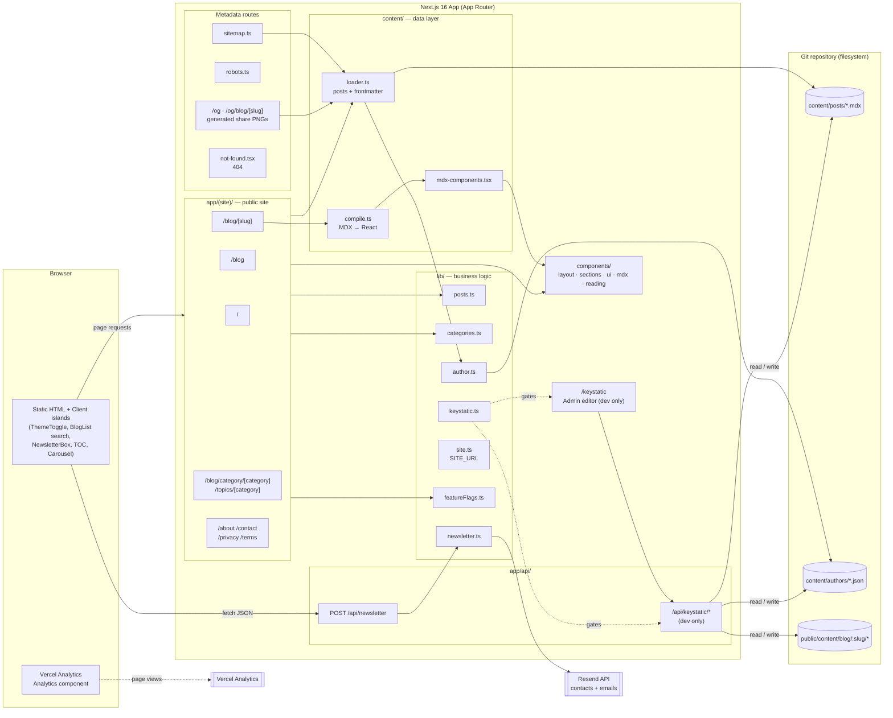
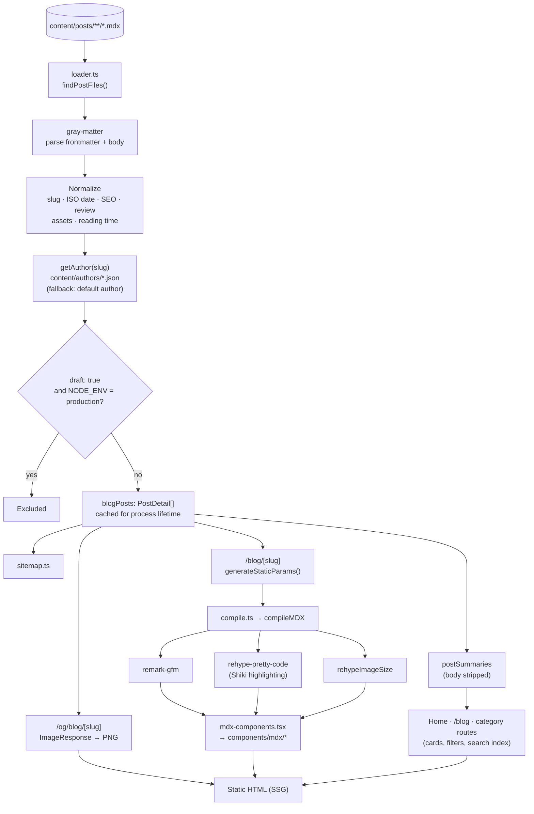
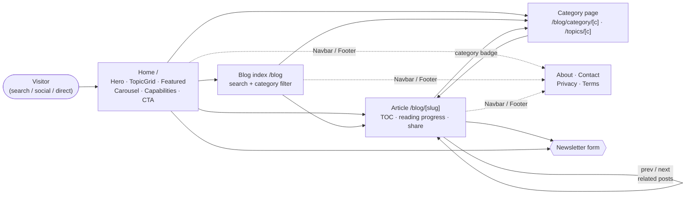
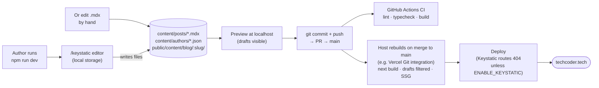

# Architecture & App Flow Diagrams

Visual companion to [architecture.md](./architecture.md). All diagrams are
[Mermaid](https://mermaid.js.org/) and render natively on GitHub and in the
VS Code Markdown preview (with a Mermaid extension).

---

## 1. System architecture

Everything runs inside one Next.js app. There is no database — content is
files in Git. The only server-side runtime call to another service is the newsletter
(Resend). In the browser, Vercel Analytics, tweets, and video/code embeds
load third-party resources.



---

## 2. Build-time content pipeline

Content is read once on the server and baked into static HTML. It is never
fetched from the browser.



---

## 3. Reader navigation flow



---

## 4. Newsletter subscription sequence

```mermaid
sequenceDiagram
    autonumber
    actor U as Reader
    participant NB as NewsletterBox (client)
    participant API as POST /api/newsletter
    participant L as lib/newsletter.ts
    participant R as Resend API

    U->>NB: Enter email, submit
    NB->>API: fetch { email }
    API->>API: Parse JSON, check type
    alt bad body
        API-->>NB: 400 { status: "invalid" }
    end
    API->>L: subscribeToNewsletter(email)
    L->>L: normalizeEmail()
    alt invalid email / missing RESEND_API_KEY
        L-->>API: invalid / error
    else
        L->>R: GET /contacts/{email}
        alt 200 exists
            R-->>L: found
            L-->>API: { status: "duplicate" }
        else 404 new
            L->>R: POST /contacts (or /audiences/{id}/contacts)
            R-->>L: created
            L->>R: POST /emails (welcome email)
            Note over L,R: Skipped if RESEND_FROM_EMAIL is unset.<br/>A failed send is logged; still "subscribed".
            L-->>API: { status: "subscribed" }
        else other error
            L-->>API: { status: "error" }
        end
    end
    API-->>NB: 200 / 400 / 502 + status
    NB-->>U: Success / already subscribed / error message
```

---

## 5. Authoring & publishing flow


